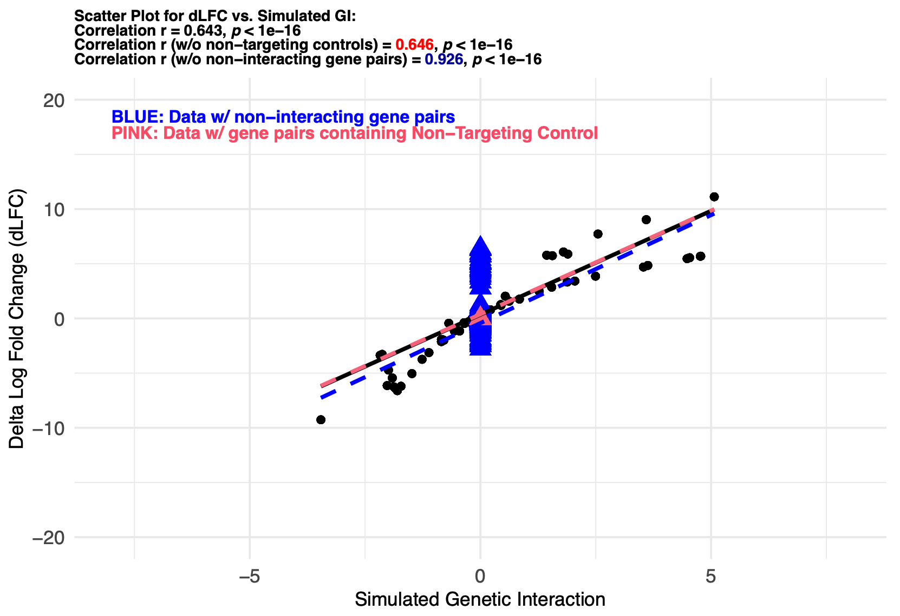

Applying GI Detection Methods on Simulated Data
===============================================

Delta Log Fold Change (dLFC) Application
----------------------------------------

Here, we show how we may apply dLFC (Dede et al., 2020) to calculate GI on simulated data, as an example
to analyze the simulation output.

.. code-block:: r

   knitr::opts_knit$set(root.dir = getwd())
   # read example simulated data
   sample_name = "example_data"
   pseudo_counts = 5e-07
   repA_path <- here::here("data", paste0(sample_name, "_repA.csv"))
   repB_path <- here::here("data", paste0(sample_name, "_repB.csv"))

   # each simulation is containing two replicates A and B, and we take average of the LFC for analysis
   cell_lib_guide2_A = read.csv(repA_path) %>% 
     dplyr::select(-X)

   cell_lib_guide2_B = read.csv(repB_path) %>% 
     dplyr::select(-X) %>% 
     dplyr::select(guide_id, counts_guide_t0, 
                   counts_guide_t1, counts_guide_t2, 
                   rel_freq_guide_t0, rel_freq_guide_t2, LFC)

   cell_lib_guide2 = merge(cell_lib_guide2_A, cell_lib_guide2_B, by = "guide_id") %>% 
     dplyr::rename(counts_guide_t0_1 = counts_guide_t0.x,
                   counts_guide_t0_2 = counts_guide_t0.y,
                   counts_guide_t1_1 = counts_guide_t1.x,
                   counts_guide_t1_2 = counts_guide_t1.y,
                   counts_guide_t2_1 = counts_guide_t2.x,
                   counts_guide_t2_2 = counts_guide_t2.y,
                   rel_freq_guide_t0_1 = rel_freq_guide_t0.x,
                   rel_freq_guide_t0_2 = rel_freq_guide_t0.y,
                   rel_freq_guide_t2_1 = rel_freq_guide_t2.x,
                   rel_freq_guide_t2_2 = rel_freq_guide_t2.y,
                   LFC_t2_1 = LFC.x,
                   LFC_t2_2 = LFC.y) %>% 
     mutate(guide1_type = ifelse(guide1_type == 1, "high", "low"),
            guide2_type = ifelse(guide2_type == 1, "high", "low"),
            construct_type = ifelse(is.na(gene2_behavior), gene1_behavior,
                                    paste0(gene1_behavior, " + ", gene2_behavior)),
            LFC_t2_1 = log2(((rel_freq_guide_t2_1 + pseudo_counts) / 
                               (rel_freq_guide_t0_1 + pseudo_counts))),
            LFC_t2_2 = log2(((rel_freq_guide_t2_2 + pseudo_counts) / 
                               (rel_freq_guide_t0_2 + pseudo_counts))))%>% 
     mutate(LFC = (LFC_t2_1 + LFC_t2_2)/2) # aggregate the LFC between 2 replicates by averaging

   # read the simulated data and prepare sample name
   sim_data = cell_lib_guide2 %>%
     mutate(construct_type = ifelse(KO_type == "SKO", "SKO",
                                    ifelse(gene1_behavior == "Non-Targeting Control" 
                                           | gene2_behavior == "Non-Targeting Control", "SKO", "DKO" )))

   nc_gene = unique(as.character(filter(sim_data, gene1_behavior == "Non-Targeting Control")$gene1))

   # calculate single mutant/knockout fitness
   gene_SMF = sim_data %>% 
     filter(construct_type == "SKO", gene1_behavior != "Non-Targeting Control") %>% 
     group_by(gene1) %>% 
     dplyr::summarise(SMF = mean(LFC))
   # calculate mean LFC for gene pairs that don't contain control
   gene_LFC = sim_data %>% 
     filter(construct_type == "DKO") %>% 
     group_by(gene_pair_id) %>% 
     dplyr::summarise(LFC_mean = mean(LFC))
   # calculate dLFC = LFC_mean - (SMF1 + SMF2)
   sim_data_dLFC = left_join(sim_data, gene_SMF, by = "gene1") %>% 
     dplyr::rename(gene1_SMF = SMF) %>% 
     left_join(gene_SMF, by = c("gene2"="gene1")) %>% 
     dplyr::rename(gene2_SMF = SMF) %>% 
     left_join(gene_LFC, by = "gene_pair_id") %>% 
     mutate(gene1_SMF = ifelse(is.na(gene1_SMF), 0, gene1_SMF),
            gene2_SMF = ifelse(is.na(gene2_SMF), 0, gene2_SMF),
            LFC_mean = ifelse(construct_type == "SKO",
                              ifelse(gene1_SMF == 0, gene2_SMF, gene1_SMF), LFC_mean)) %>% 
     mutate(dLFC = LFC_mean - (gene1_SMF+gene2_SMF))

   # add data frame for the non-control group
   control = sim_data_dLFC %>% filter(gene1 %in% nc_gene | gene2 %in% nc_gene)
   sim_dLFC_noncontrol = sim_data_dLFC %>% anti_join(control, by = "gene1_gene2_id")
   # add data frame for the non-interacting group
   control0 = sim_data_dLFC %>% filter(interaction_gene == 0)
   sim_dLFC_noncontrol0 = sim_data_dLFC %>% anti_join(control0, by = "gene1_gene2_id")

   # compute correlation and p-values
   cor_test_all <- cor.test(sim_data_dLFC$interaction_gene, 
                            sim_data_dLFC$dLFC, method = "pearson")
   cor_test_noncontrol <- cor.test(sim_dLFC_noncontrol$interaction_gene, 
                                   sim_dLFC_noncontrol$dLFC, method = "pearson")
   cor_test_noncontrol0 <- cor.test(sim_dLFC_noncontrol0$interaction_gene, 
                                    sim_dLFC_noncontrol0$dLFC, method = "pearson")
   # show correlation value
   print(cor_test_all)
   print(cor_test_noncontrol)
   print(cor_test_noncontrol0)

Visualizations
--------------

Then you may create visualizations on scatterplots to the calculated GI in this dLFC example. Example output are shown
as follows:

.. code-block:: r

   library(ggplot2)
   library(ggtext)

   # define a function to format p-values if p-values are extremely small
   format_p <- function(pval) {
     if (is.na(pval)) return("NA")
     if (pval < 1e-16) {
       return("< 1e-16")
     } else {
       return(formatC(pval, format = "e", digits = 2))
     }
   }

   # plot the scatterplot
   xlim = c(-8,8)
   ylim = c(-20,20)

   theme_text = theme(
     plot.title = element_markdown(size = 8, face = "bold"),   # Title size
     axis.title.x = element_text(size = 10),  # X-axis title
     axis.title.y = element_text(size = 10),  # Y-axis title
     axis.text.x = element_text(size = 10),   # X-axis text
     axis.text.y = element_text(size = 10),   # Y-axis text
     legend.title = element_text(size = 10),  # Legend title
     legend.text = element_text(size = 10),   # Legend text
     strip.text = element_text(size = 15)     # Facet labels
   )
   scatterplot_dlfc = ggplot(sim_data_dLFC, aes(x = interaction_gene, y = dLFC)) +
     geom_point(alpha = 0.7, color = "black") +
     geom_point(data = control0, aes(x = interaction_gene, y = dLFC), 
                size = 3, shape = 17, color = "blue", fill = "yellow", stroke = 1.5) +
     geom_point(data = control, aes(x = interaction_gene, y = dLFC), 
                size = 3, shape = 17, color = "#f76d84", fill = "yellow", stroke = 1.5) +
     # Regression line for all data
     geom_smooth(method = "lm", col = "black", se = FALSE, linetype = "solid") + 
     # Regression line for non-control data
     geom_smooth(data = sim_dLFC_noncontrol, aes(x = interaction_gene, y = dLFC), 
                 method = "lm", col = "#f76d84", se = FALSE, linetype = "dashed") + 
     # Regression line for non-zero genetic interactions data
     geom_smooth(data = sim_dLFC_noncontrol0, aes(x = interaction_gene, y = dLFC), 
                 method = "lm", col = "blue", se = FALSE, linetype = "dashed") + 
     ggtitle(paste0(
     "Scatter Plot for dLFC vs. Simulated GI: ",
     "Correlation r = ", round(cor_test_all$estimate, 3), 
     ", *p* ", format_p(cor_test_all$p.value), " ",
     "Correlation r (w/o non-targeting controls) = ", round(cor_test_noncontrol$estimate, 3),
     ", *p* ", format_p(cor_test_noncontrol$p.value), " ",
     "Correlation r (w/o non-interacting gene pairs) = ", round(cor_test_noncontrol0$estimate, 3), 
     ", *p* ", format_p(cor_test_noncontrol0$p.value))) +
     labs(color = "Gene-gene Interaction Type") +
     guides(color = guide_legend(override.aes = list(size = 5))) +
     ylim(ylim[1],ylim[2])+
     xlim(xlim[1],xlim[2])+
     theme_minimal() +
     xlab("Simulated Genetic Interaction") +
     ylab("Delta Log Fold Change (dLFC)") +
     # Add annotation label for control points
     annotate("text", x = xlim[1], 
              y = ylim[2]-3, 
              label = "PINK: Data w/ gene pairs containing Non-Targeting Control", 
              color = "#f85470", size = 3, hjust = 0, fontface = "bold") +
     # Add annotation label for non-interacting points
     annotate("text", x = xlim[1], 
              y = ylim[2]-1.5, 
              label = "BLUE: Data w/ non-interacting gene pairs", 
              color = "blue", size = 3, hjust = 0, fontface = "bold")  +
     theme_text

   # show the plot
   options(repr.plot.width = 8, repr.plot.height = 10)
   scatterplot_dlfc

Check example output in the pre-built DKOsimR vignettes (:download:`PDF <files/DKOsimR_vignettes.pdf>`) Section 6.