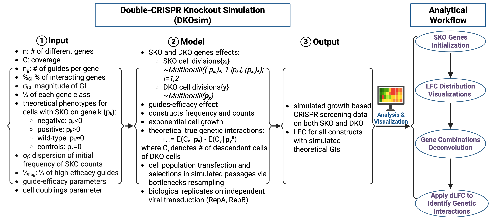

Tutorial
========

How to generate synthetic CRISPR data using DKOsimR?

.. admonition:: Abbreviations

   **KO**, knockout; **SKO**, single knockout; **DKO**, double knockout; **%**, percentage;
   **GI**, genetic interaction; **std. dev.**, standard deviation.

Introduction
------------

DKOsimR is an R package designed for generating synthetic CRISPR double-knockout
screening data. It allows researchers to simulate cell growth dynamics and
genetic interactions between gene pairs under controlled library setup and 
experimental conditions.

This tutorial demonstrates:

- :ref:`Installation guide <installation>`
- :ref:`Graphical overview of simulation framework <graph-workflow>`
- :ref:`List of tunable parameters <list-parameters>`
- :ref:`Quickstart on default workflow to run simulation <quick_start>`
- :ref:`Guide to customize simulation setup and approximate lab data <custom_sim>`
- :ref:`Summary on why use DKOsimR 
`

.. _installation:

Installation
------------

To start running simulation, simply download and install R/RStudio as the first step. You may then install DKOsimR with following commands:

.. code-block:: r

   if(!requireNamespace("devtools", quietly = TRUE))
       install.packages("devtools")

   devtools::install_github("yuegu-phd/DKOsimR", quiet = TRUE)
   devtools::install(dependencies = TRUE)

Make sure all required dependencies are installed using ``devtools::install(dependencies = TRUE)``.

Then you may simply load the package:

.. code-block:: r

   library(DKOsimR)
   
.. _graph-workflow:

Graphical Overview of Study Design
----------------------------------

.. _list-parameters:

List of Tunable Parameters
--------------------------

Initialized Library Parameters
~~~~~~~~~~~~~~~~~~~~~~~~~~~~~~

- **sample_name**: name of the simulation run
- **coverage**: cell representation per guide
- **n**: number of unique single gene
- **n_guide_g**: number of guide per gene
- **moi**: multiplicity of infection - % of cells that are transfected by any virus
- **sd_freq0**: dispersion of initial counts distribution

Genetic Interaction (GI) Parameters
~~~~~~~~~~~~~~~~~~~~~~~~~~~~~~~~~~~

- **p_gi** : proportion of interacting gene pairs
- **sd_gi** : std. dev. of re-sampled phenotype with GI presence

Gene Class Parameters
~~~~~~~~~~~~~~~~~~~~~

Percentage (%) of theoretical phenotype to each gene class
^^^^^^^^^^^^^^^^^^^^^^^^^^^^^^^^^^^^^^^^^^^^^^^^^^^^^^^^^^

   - **pt_neg**: % negative
   - **pt_pos**: % positive
   - **pt_wt**: % wild-type
   - **pt_ctrl**: % non-targeting control

Mean and std. dev. of theoretical phenotype
^^^^^^^^^^^^^^^^^^^^^^^^^^^^^^^^^^^^^^^^^^^

   - **mu_neg**: mean of negative genes
   - **sd_neg**: std. dev. of negative genes
   - **mu_pos**: mean of positive genes
   - **sd_pos**: std. dev. of positive genes
   - **sd_wt**: std. dev. of wild-type genes

Guide Parameters
~~~~~~~~~~~~~~~~

High-efficacy guides proportion and CRISPR mode
^^^^^^^^^^^^^^^^^^^^^^^^^^^^^^^^^^^^^^^^^^^^^^^

   - **p_high** : proportion of high-efficacy guides
   - **mode**: CRISPR mode:

      - use CRISPRn-100%Eff if need 100% effcient guides without randomization
      - use CRISPRn if need high-efficient guides drawn from distribution

Mean and std. dev. of guide-efficacy
^^^^^^^^^^^^^^^^^^^^^^^^^^^^^^^^^^^^

   - **mu_high**: mean of high-efficacy guides
   - **sd_high**: std. dev of high-efficacy guides
   - **mu_low**: mean of low-efficacy guides
   - **sd_low**: std. dev of low-efficacy guides

Cell Doublings Parameters
~~~~~~~~~~~~~~~~~~~~~~~~~

   - **size.bottleneck**: bottleneck size - threshold indicating the ceiling of cell growth
   - **n.bottlenecks**: number of bottleneck encounters - how many times do we encountering bottlenecks?
   - **n.iterations**: number of maximum doubling cycles, by default, we assume a maximum of 30 doublings if we didn't encounter bottleneck

Randomization Parameter
~~~~~~~~~~~~~~~~~~~~~~~

   - **rseed**: values used for random number generator - use same number to control same sets of genes having GI

Miscellaneous
~~~~~~~~~~~~~

   - **path**: path to directory to save outputs of data and logs from simulation
   - **cores_free**: number of cores that are left to be free in parallel computing

.. _quick_start:

Quick Start
-----------

After loading DKOsimR, to run a simulation with default parameters, you may simply use

.. code-block:: r

   dkosim(sample_name = "test", n = 40)

Adjust sample_name and n to name run and initialize number of perturbed genes. Output data will be generated in current working directory.

Alternatively, you may run a simulation in lab approximating mode, by default

.. code-block:: r

   dkosim_lab(sample_name = "test_lab", n = 20)

This function applies parameter settings that approximate realistic laboratory data distributions.

.. _custom_sim:

Customized Simulation
---------------------

All tunable parameters may be adjusted by desires in both mode. For example,

.. code-block:: r

   dkosim(sample_name="test",
          coverage=10,
          n=60,
          n_guide_g=2,
          sd_freq0 = 1/3.29,
          moi = 0.3,
          p_gi=0.03,
          sd_gi=1.5,
          p_high=1,
          mode="CRISPRn-100%Eff",
          pt_neg=0.15,
          pt_pos=0.05,
          pt_wt=0.75,
          pt_ctrl=0.05,
          mu_neg=-0.75,
          sd_neg=0.1,
          mu_pos=0.75,
          sd_pos=0.1,
          sd_wt=0.25,
          size.bottleneck = 2,
          n.bottlenecks= 1,
          n.iterations = 30,
          rseed = 111,
          path = ".")

Output data will be generated in current working directory.

.. _sim_lab:

Simulation Approximating Laboratory Data
----------------------------------------

DKOsimR also provides a wrapper function for lab approximating mode to simulate data that resembles
real laboratory CRISPR screening datasets:

.. code-block:: r

   dkosim_lab(sample_name = "test_lab", n = 20)

This function applies parameter settings that approximate realistic laboratory
data distributions.

All parameters can be further customized by users to fit specific experimental setup as desired in both mode, for example:

.. code-block:: r

   dkosim(sample_name="test",
          coverage=10,
          n=60,
          n_guide_g=2,
          sd_freq0 = 1/3.29,
          moi = 0.3,
          p_gi=0.03,
          sd_gi=1.5,
          p_high=1,
          mode="CRISPRn-100%Eff",
          pt_neg=0.15,
          pt_pos=0.05,
          pt_wt=0.75,
          pt_ctrl=0.05,
          mu_neg=-0.75,
          sd_neg=0.1,
          mu_pos=0.75,
          sd_pos=0.1,
          sd_wt=0.25,
          size.bottleneck = 2,
          n.bottlenecks= 1,
          n.iterations = 30,
          rseed = 111,
          path = ".")

.. _summary:

Summary
-------

DKOsimR enables researchers to:

- generate reproducible synthetic CRISPR screening datasets
- benchmark genetic interaction detection methods
- evaluate and optimize experimental design parameters

For further information, please refer to the API documentation and the vignettes files for DKOsimR R package.